# CMOS Digital Circuit Analysis using SKY130 PDK

This repository presents the design, simulation, layout, and characterization of CMOS digital circuits using the SKY130 open-source PDK.  
The work includes device-level MOSFET analysis, CMOS inverter characterization, layout verification, and post-layout simulations using open-source VLSI tools.

---

## 📌 Objectives
- Perform NMOS & PMOS I–V characterization  
- Design and simulate a CMOS inverter  
- Extract VTC, noise margins, rise/fall times, and propagation delays  
- Measure power consumption  
- Create layout using Magic  
- Extract the netlist from the layout  
- Perform LVS (Layout vs Schematic) using Netgen  

---

## 🛠 Tools Used
- **Xschem** – schematic design  
- **Ngspice** – circuit simulation  
- **Magic VLSI** – layout & extraction  
- **Netgen** – LVS verification  
- **SKY130 PDK**

---

# 1️⃣ NMOS & PMOS Characterization


MOSFET I–V characteristics help understand device behavior in linear, saturation, and subthreshold regions.

---

### **Procedure**
- Designed NMOS and PMOS characterization schematics in Xschem  
- Performed DC sweep of **VGS (0–1.8 V)** at fixed **VDS**  
- Simulated using Ngspice  
- Extracted **ID–VGS** and **ID–VDS** curves  

---

---

### **Plots**

#### **NMOS**
**Schematic:**  
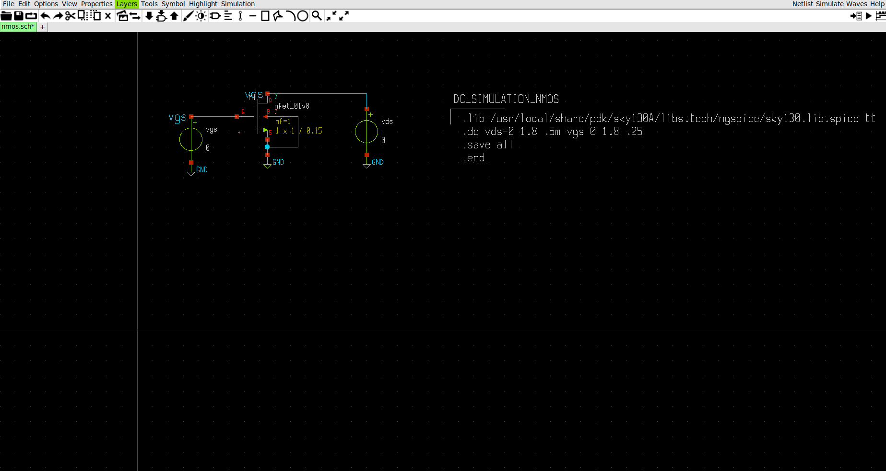

**I–V Characteristics NMOS:**  
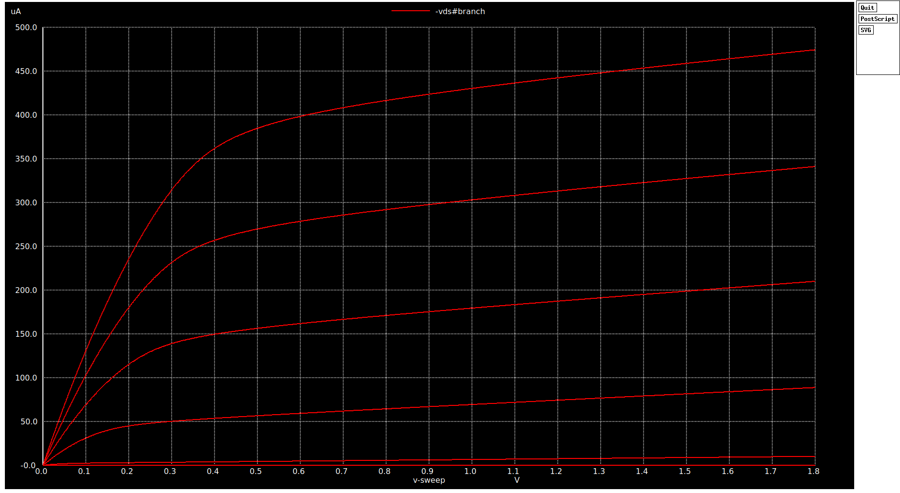

**Explanation:**  
In the *ID–VGS* curve, the current stays almost zero when **VGS < VTH** — this is the **cutoff region**, where no channel is formed.  
Once **VGS crosses VTH**, the channel begins to form and the drain current increases; this corresponds to the **linear/ohmic region/Resistive **.  
When the condition **VDS ≥ VGS – VTH** is met, the MOSFET enters **saturation**, visible as the flatter portion of the curve.  
A slight upward slope even in saturation is due to **channel-length modulation**, where ID increases slightly with VDS.

---

#### **PMOS**
**Schematic:**  


**I–V Characteristics PMOS:**  
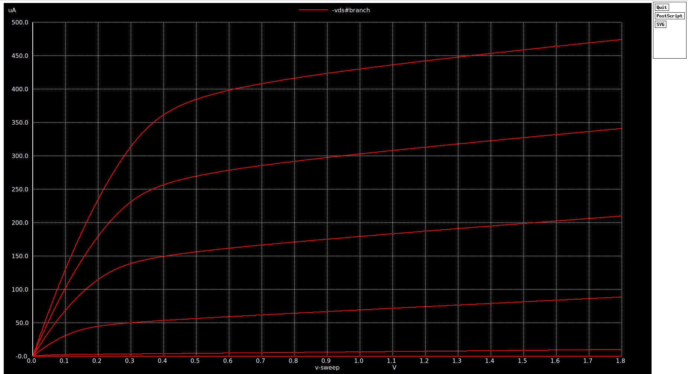

**Explanation:**  
In the *ID–VGS (or ID–VSG)* curve for PMOS, the drain current is nearly zero when **VSG < |VTP|**, indicating the **cutoff region**.  
When **VSG exceeds |VTP|**, a channel forms and the current increases in the negative direction (typical PMOS behavior).  
The device reaches **saturation** when **VSD ≥ VSG – |VTP|**, shown by the flat region in the plot.  
PMOS currents are generally lower than NMOS due to **lower hole mobility**.

### Ngspice Commands (Interactive)

```spice
.dc vgs 0 1.8 1m vds 0 1.8
plot  vgs 
plot  vds
````

# 2️⃣ CMOS Inverter Analysis

The CMOS inverter is the fundamental building block of digital logic.  
Key parameters characterized:

- **Voltage Transfer Curve (VTC)**
- **Switching Threshold (VM)**
- **Noise Margins (NMH, NML)**
- **Rise and Fall Time**
- **Propagation Delays (tpHL, tpLH)**

---

## **Design**
- Inverter designed using **sky130_fd_pr** devices  
- **NMOS width = 1 µm**, **PMOS width = 2 µm**  
- Custom **inverter symbol** created in *Xschem*  
- Testbench prepared for DC sweep and transient analysis  

**Inverter Schematic:**  
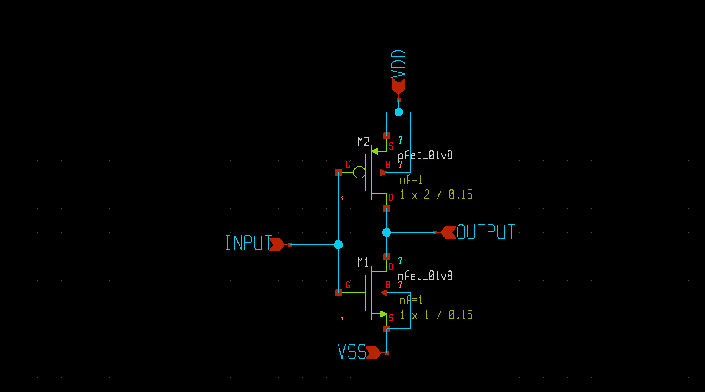

**Inverter Symbol:**  
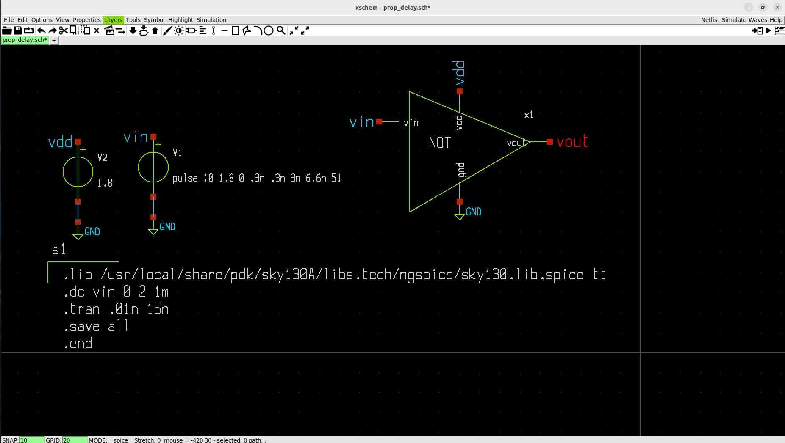

---

## **Procedure**

### **1. VTC (Voltage Transfer Characteristics)**
- Performed **DC sweep** of VIN from 0 V to VDD  
- Used NGSpice measurement:
```spice
.lib
.dc vin 0 2 1m
.save all
.end
````
- Used NGSpice commands
```spice
meas dc vm when vin=vout
````
## **Waveforms**

### **1. VTC (Voltage Transfer Curve)**
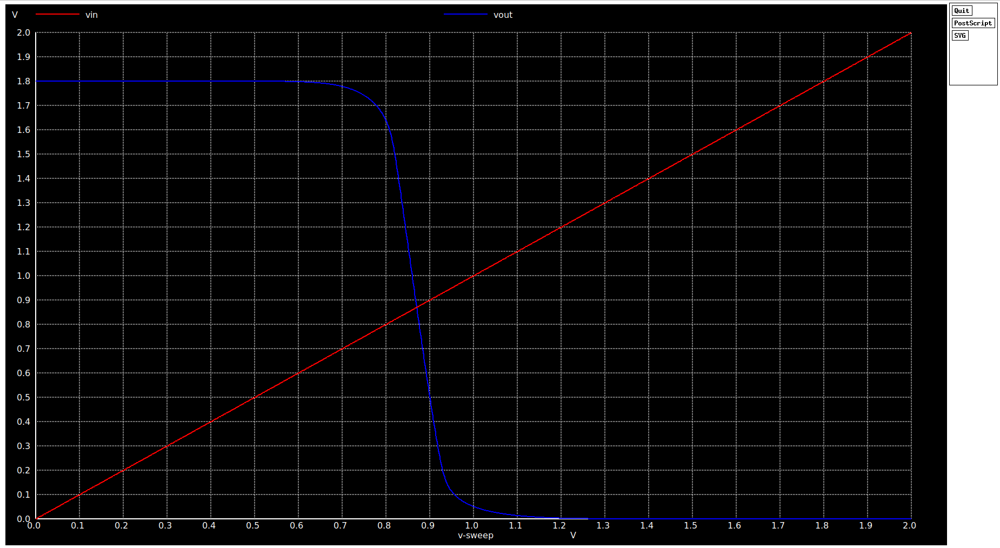

### **VTC Analysis**

The Voltage Transfer Curve (VTC) characterizes the static behavior of the CMOS inverter.  
It shows how the output voltage (Vout) changes with respect to the input voltage (Vin).  
A key parameter extracted from the VTC is the **switching threshold (VM)**, the point where:

\[
V_{in} = V_{out}
\]

### **Effect of PMOS/NMOS Sizing on VM**

To study device sizing impact, the PMOS width was varied while keeping the NMOS width fixed at **1 µm**:

| NMOS Width | PMOS Width | VM (Measured) |
|------------|------------|---------------|
| 1 µm       | 2 µm       | 0.8698 V      |
| 1 µm       | 4 µm       | 0.8930 V      |

### **Observation**

- Increasing the **PMOS width** shifts the **VM slightly upward**.
- A stronger PMOS increases the pull-up drive, causing the inverter to switch at a **higher input voltage**.

### **Switching Threshold (VM)**

The **switching threshold (VM)** is the input voltage at which the inverter output is exactly at the same voltage level as the input:

\[
V_{in} = V_{out}
\]

At this point, both NMOS and PMOS are partially ON, and their drain currents are equal:

\[
I_{D,n} = I_{D,p}
\]

VM determines the **logic switching point** of the inverter:
- If Vin < VM → Output is HIGH  
- If Vin > VM → Output is LOW  

A properly chosen VM improves noise margins and creates a symmetrical switching characteristic.

The measured values:

- **VM = 0.8698 V** (PMOS = 2 µm)  
- **VM = 0.8930 V** (PMOS = 4 µm)

These results show how **device sizing directly influences the inverter’s switching point**.  
A wider PMOS strengthens the pull-up network, requiring a slightly higher Vin for the NMOS to dominate and switch the output LOW.  
This upward shift is expected and confirms correct transistor behavior.


### **VM Measurement (NGSpice Output)**
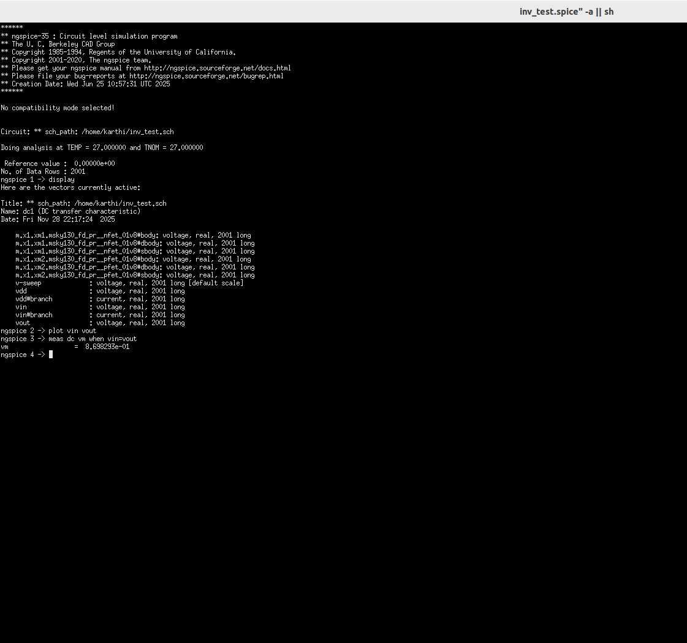

---
## **Noise Margin Analysis**

### **Noise Margin Plot**
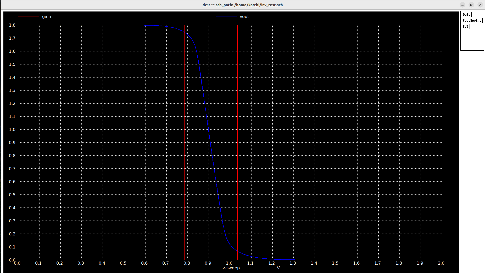

- **VIL = 7.855e-1 V**  
- **VIH = 1.03344e+0 V**

### **Noise Margin Calculation (NGSpice Window)**
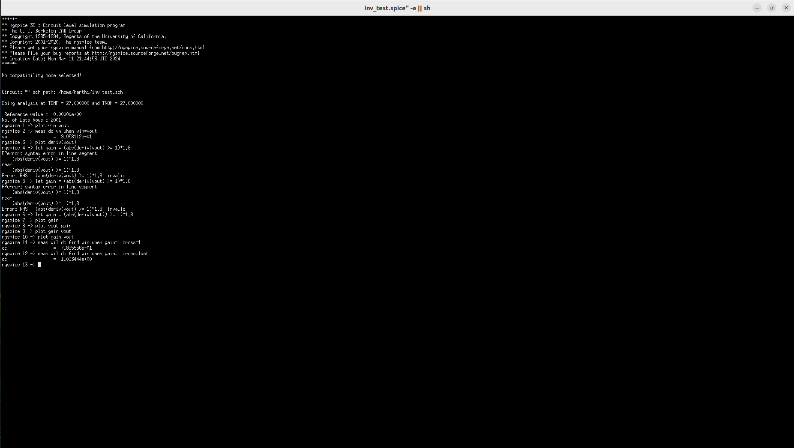

**Noise Margins:**

### **1. NMH (Noise Margin High)**  
Using the formula:  
\[
NMH = VOH - VIH
\]

Given:  
- \( VOH = 1.8\,V \)  
- \( VIH = 1.03344\,V \)

\[
NMH = 1.8 - 1.03344 = 0.76656\,V
\]

---

### **2. NML (Noise Margin Low)**  
Using the formula:  
\[
NML = VIL - VOL
\]

Given:  
- \( VIL = 0.7855\,V \)  
- \( VOL = 0\,V \)

\[
NML = 0.7855 - 0 = 0.7855\,V
\]

---

### **Final Noise Margins**
- **NML = 0.7855 V**  
- **NMH = 0.76656 V**


  ---
  ## **Propagation Delay**

### **Propagation Delay Values (NGSpice Output)**
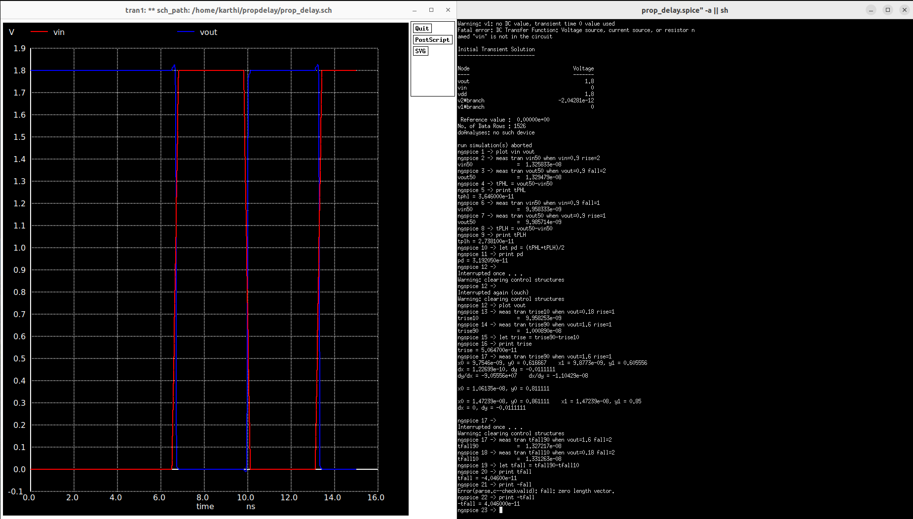

- **tpHL = 3.64e-11 s**  
- **tpLH = 2.7381e-11 s**  
- **Propagation Delay = 3.192e-11 s**

---

## **Rise and Fall Times**

- **Rise Time (trise) = 5.0647e-11 s**  
- **Fall Time (tfall) = 4.046e-11 s**

---


## **Transient Response**
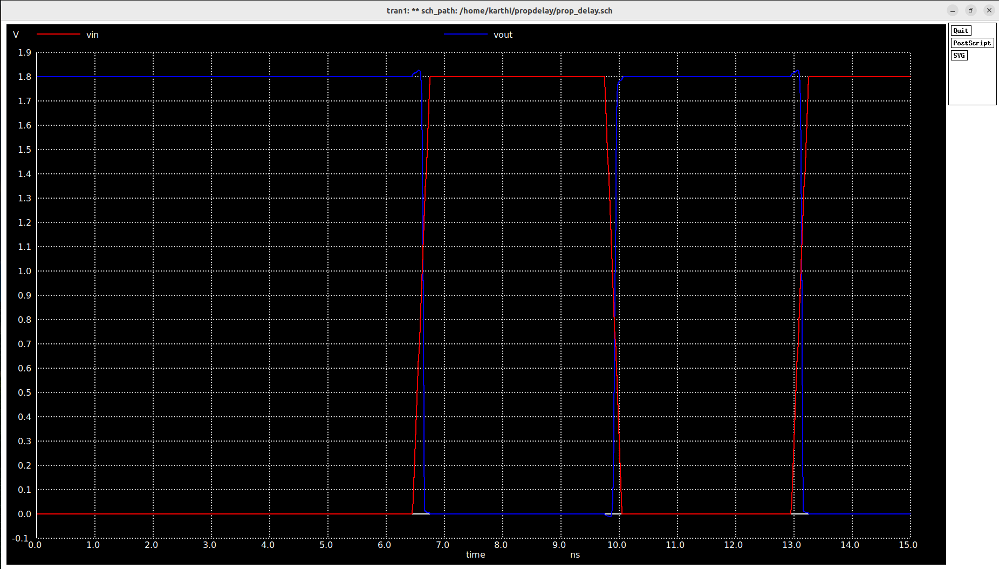

  


---

# 3️⃣ Layout, Extraction & LVS

### **Procedure**
- Designed inverter layout in Magic  
- Ensured DRC clean  
- Extracted netlist using `ext2spice`  
- Performed LVS with Netgen  

### **Files Generated**
- `inverter.mag` – layout  
- `extracted.spice` – extracted netlist  
- `lvs_report.log` – LVS comparison  

**Screenshots:**  
_Add layout, DRC, and LVS images here_

---

# 4️⃣ Post-Layout Simulation

### **Procedure**
- Simulated extracted netlist including parasitics  
- Ran transient and VTC analysis  

### **Pre vs Post Layout Comparison**
(Replace values)

| Parameter | Pre-Layout | Post-Layout |
|----------|------------|-------------|
| tpHL     | XXX ps     | XXX ps      |
| tpLH     | XXX ps     | XXX ps      |
| Rise time | XXX ns    | XXX ns      |
| Fall time | XXX ns    | XXX ns      |

**Plots:**  
_Add post-layout waveform images here_

---

## 📌 Conclusion
This project demonstrates a complete open-source digital design flow using the SKY130 PDK, covering device-level MOSFET behavior, CMOS inverter analysis, layout verification, and post-layout performance evaluation.

---

## 📁 Repository Structure (Suggested)
